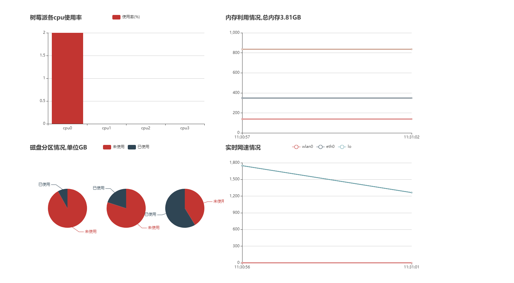

# 项目说明

之前在玩树莓派时看到了这个项目 http://shumeipai.nxez.com/2017/08/31/pi-dashboard-released.html ,但是不懂PHP环境搭建的我冒出了一个想自己写一个仪表盘的想法

前端:由jquery和echats组合完成的(救救孩子吧,真不会写啊)我会继续整合的代码

后端:通过flask框架和python来展示树莓派的性能

项目还未完善...后期想加入可以查看所有进程
